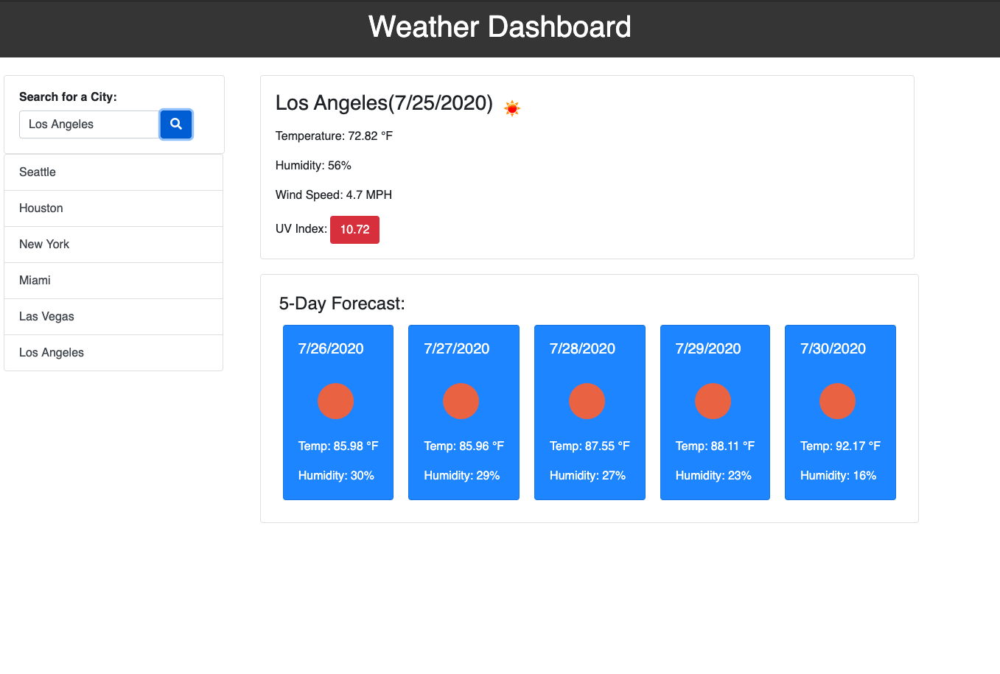

# homework_6
Weather Dashboard

## Description
- I want to create a weather app that allows me to view a current/five day forecast of the location that I put in.
- I should allow me to save the cities that I have searched for and be able to click on them to search them again.
- The app should show me date, temp, humidity, uv index, and wind speed.

## Screen Shot 

## Tech Used
- HTML 5
- CSS 3
- Bootstrap 4
- Javascript
- jQuery
- Moment.js
- Open Weather API

## Link To Deployed App
https://itsmikechang.github.io/homework_6/

## Link To Repo
https://github.com/itsmikechang/homework_6

